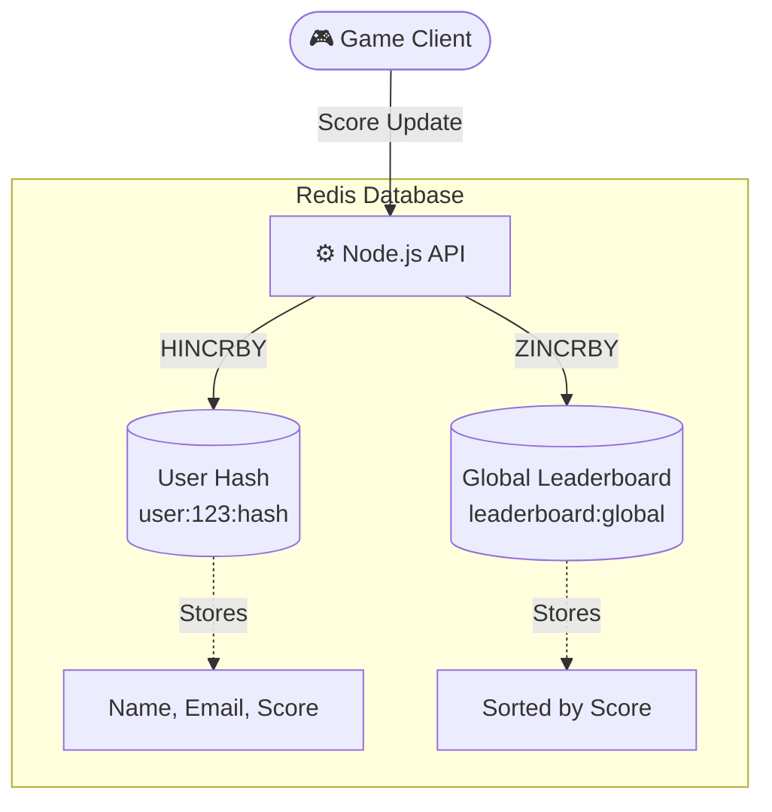

# 🏆 Redis Live Leaderboard 🚀

<div align="center">
  
</div>

<p align="center">
  
  
  
</p>

## 🏗️ Architecture



## ✨ What I Learned

This project demonstrates the power of **Redis** for building extremely fast, real-time gaming leaderboards. I learned how to combine different Redis data structures to maintain state and instantly calculate global rankings!

### 1️⃣ The "Object": User Profiles (Redis Hashes) 🪪
Instead of stringifying JSON, I used Redis **Hashes** to store individual user details (like name, email, and score).
* **Commands:** `HSET`, `HGETALL`, `HINCRBY`
* **Why?** It acts like a fast, in-memory dictionary. You can increment a specific field (like score) in `O(1)` time without fetching the entire object!

### 2️⃣ The "Global": The Leaderboard (Redis Sorted Sets) 🌍
Hashes can't tell you who is in 1st place. For that, I used **Sorted Sets (`ZSET`)**.
* **Commands:** `ZINCRBY`, `ZSCORE`, `ZREVRANGE`, `ZREVRANK`
* **Why?** It automatically sorts all users by their score in `O(log(N))` time. No need for complex SQL `ORDER BY` queries!

### 🤝 Keeping Them in Sync
The biggest architectural lesson was learning that **Hashes and Sorted Sets must work together**. 
When a user earns points, both data structures must be updated simultaneously:
```javascript
// 1. Add points to the User's Profile (Hash)
await redis.hincrby(`user:${id}:hash`, "score", incr);

// 2. Add points to the Global Leaderboard (Sorted Set)
await redis.zincrby(`leaderboard:global`, incr, id);
```

---
<div align="center">
  <i>Built with ❤️ using Redis & Node.js</i>
</div>
