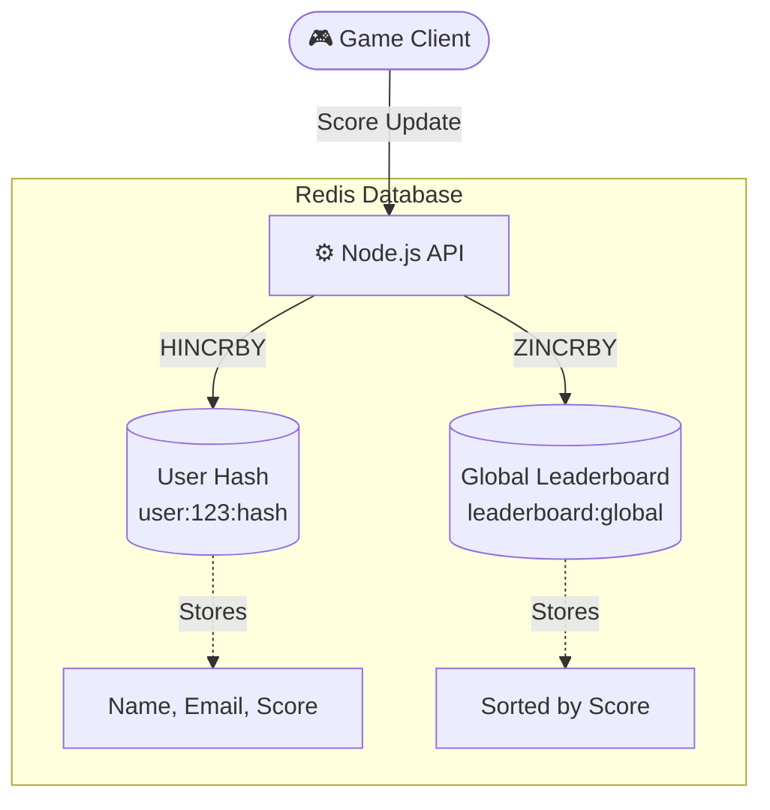

  

  
  
  
  

## 🚀 The Redis Learning Journey

This repository documents my comprehensive journey from learning the absolute basics of Redis to implementing advanced, enterprise-grade architectures like distributed message queues and real-time leaderboards. 

Here are the major stepping stones covered in this playground:

### 🛠️ 1. Infrastructure Setup
* **`01-setup-local-redis`**: Containerized infrastructure using Docker Compose to run an isolated Redis instance locally.

### 🔑 2. Core Concepts & Strings
* **`02-site-banner`**: Using simple Key-Value pairs (`SET`, `GET`) to instantly update dynamic UI elements like site-wide banners without hitting a primary database.
* **`03-login-otp-ttl`**: Exploring Data Expiration (`EXPIRE`, `TTL`) to implement secure, time-bound One-Time Passwords (OTPs) for authentication systems.

### 🪪 3. Complex Data Structures (Hashes & Caching)
* **`04-user-profile`**: Moving beyond simple strings to Redis Hashes (`HSET`, `HGETALL`). Storing complex user profile objects in memory for lightning-fast retrieval (`O(1)` complexity).

### 📨 4. Asynchronous Processing & Queues
* **`05-email-queue-redis-list`**: Understanding the primitive building blocks of message queues using Redis Lists (`LPUSH`, `RPOP`) to process background email tasks.
* **`06-bullmq-infrastructure`**: Evolving the primitive lists into a robust, production-ready distributed job queue using the **BullMQ** library, supporting retries, delays, and worker concurrency.

### 🔔 5. Real-Time Communication
* **`07-pub-sub-notification`**: Implementing the Publish/Subscribe (`PUBLISH`, `SUBSCRIBE`) pattern for instant microservice communication and real-time user notifications.

### 🏆 6. Advanced Ranking & Sorting
* **`08-live-leaderboard`**: The final milestone! Combining Hashes (for user data) and **Sorted Sets (`ZSET`)** to build a highly scalable, real-time gaming leaderboard capable of sorting thousands of users instantly via `ZINCRBY` and `ZREVRANGE`.

---

## 🏗️ The Leaderboard Architecture Highlight

A key highlight of this repository is the Live Leaderboard architecture which uses synchronized Data Structures:

 

  <i>Built with ❤️ using Redis & Node.js</i>

